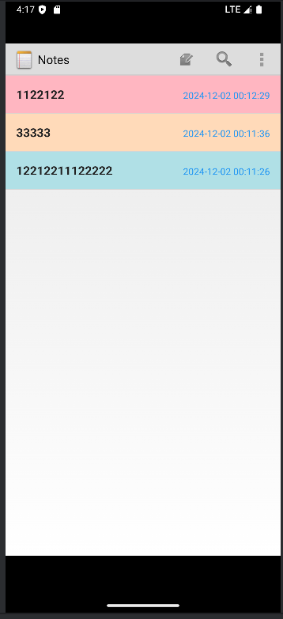
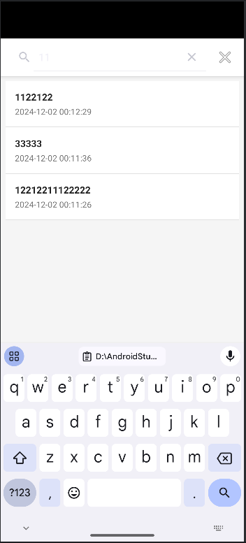
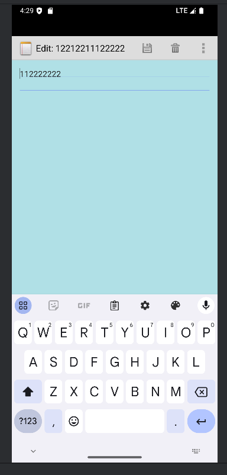

1. 时间戳功能：
- 显示最后修改时间
- 时间格式: YYYY-MM-DD HH:mm:ss
- 在右侧以蓝色显示

2. 搜索笔记功能：
- 支持标题和内容关键词搜索
- 实时搜索结果显示
- 搜索结果高亮显示关键词
- 点击搜索结果可直接跳转到对应笔记

3. 界面美化（标题和内容背景七彩色循环）：
- 支持更换笔记背景颜色
- 提供7种预设颜色选择
- 颜色设置会自动保存
- 支持列表视图中显示不同背景色
- 包含自定义背景色选择器

4. 其他功能：
- 笔记编辑、保存、删除
- 支持笔记列表排序
- 简洁美观的Material Design风格界面

## 技术实现说明

### 布局文件结构
- `note_editor.xml`: 笔记编辑界面布局
- `note_search.xml`: 搜索功能界面布局
- `searchlist_item.xml`: 搜索结果列表项布局
- `noteslist_item.xml`: 笔记列表项布局
- `note_color.xml`: 颜色选择器布局
- `background.xml`: 背景设置布局

### 主要功能实现
1. 时间戳显示
- 使用 TextView 在笔记列表项右侧显示
- 通过 SimpleDateFormat 格式化时间
- 应用蓝色文本样式

2. 搜索功能
- 实现实时搜索监听器
- 使用 SQLite 数据库模糊查询
- 搜索结果通过 ListView 动态显示

3. 界面美化
- 使用自定义背景选择器
- 通过 SharedPreferences 保存颜色设置
- 实现背景色循环切换逻辑

### 资源文件
- `ic_menu_save.png`: 保存按钮图标
- `note_search_icon.png`: 搜索图标
- `ic_menu_change_background.xml`: 更换背景按钮样式
- `close_icon.png`: 关闭按钮图标

