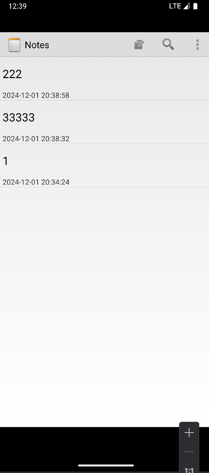
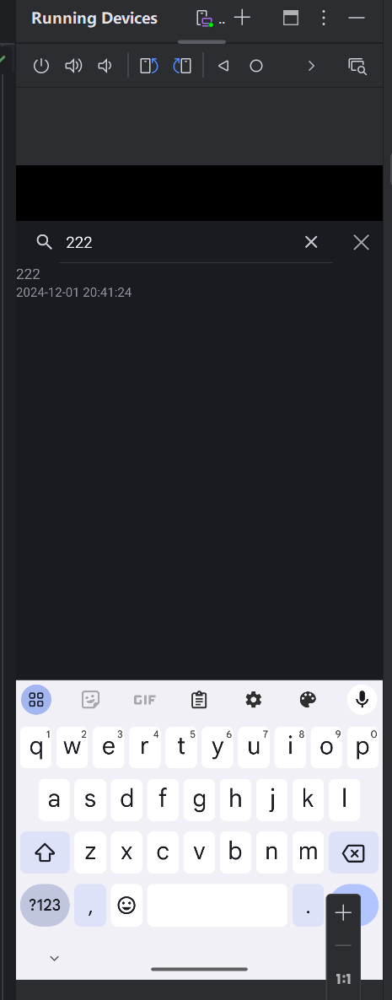
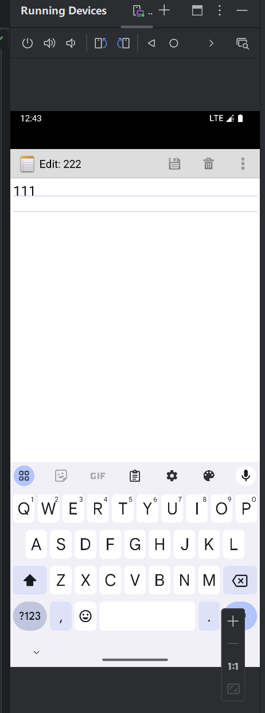
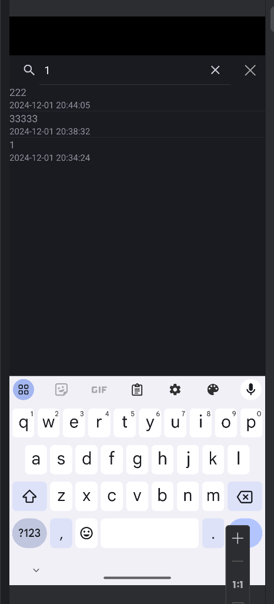
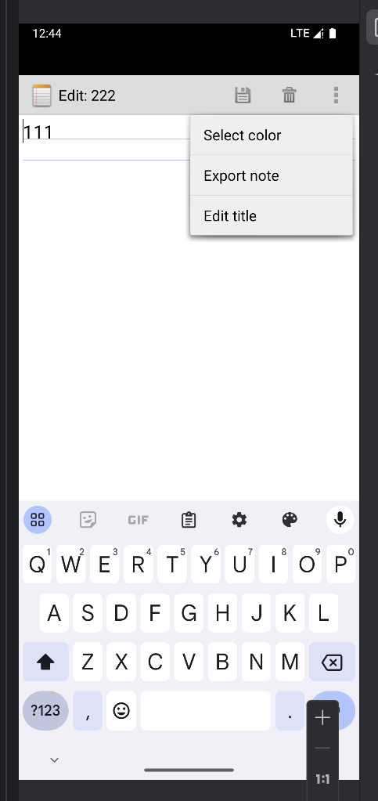
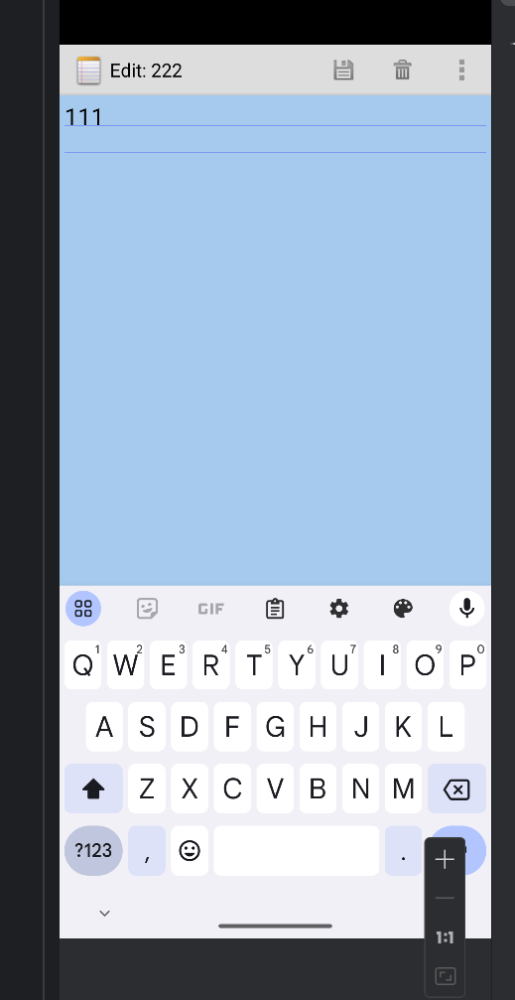
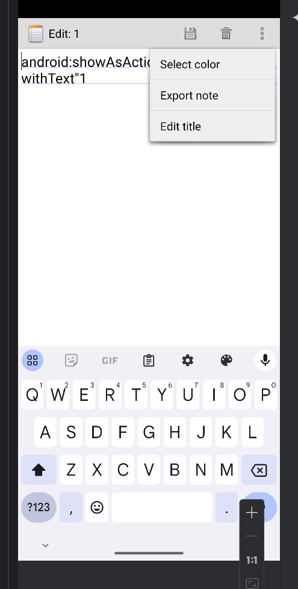
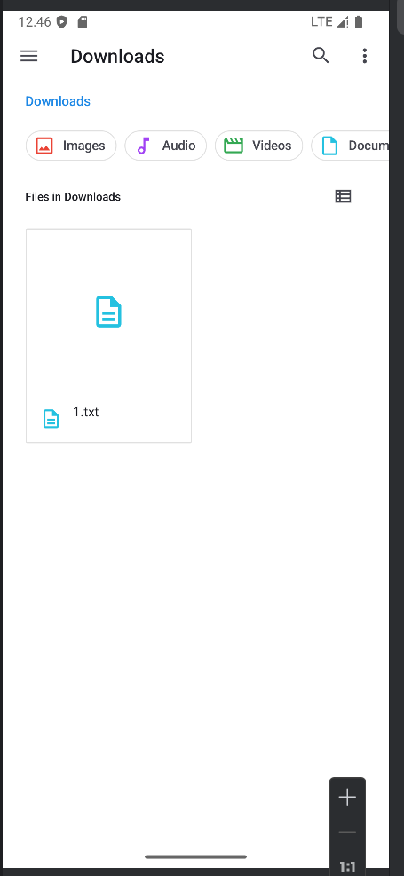
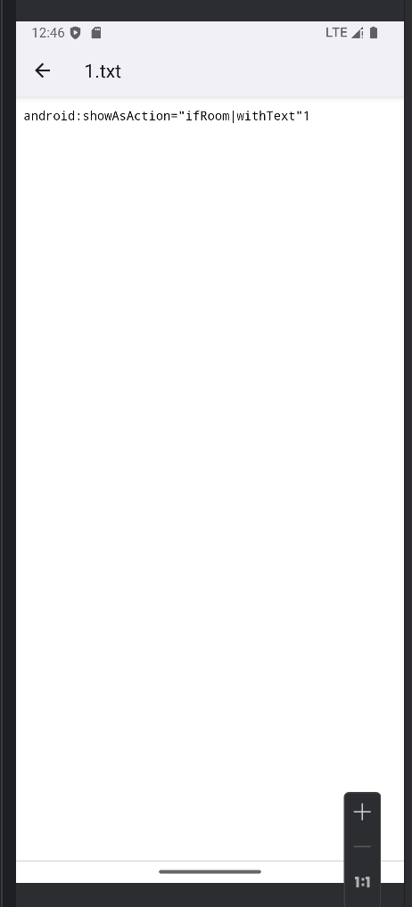

# Notepad期中项目

## 一、功能模块

### 1.时间戳功能

如图，创建一个笔记或者进入编辑保存以后，会按照动作的时间更新时间戳。

### 2.搜索功能

如图，可以根据标题搜索或者通过笔记内容模糊搜索，搜索框的×可以快速删除输入内容，搜索框外边的×可以快速关闭搜索界面回到主界面。

### 3.更改背景色功能（编辑界面背景色）

如图，在菜单功能项，点击Select color然后选择想要的颜色，保存后即可完成对背景色的修改

### 4.导出笔记内容

如图，点击菜单项选择Export note然后会直接把笔记以.txt形式导出到模拟器的File文件的download下

## 二、功能实现

### 1.时间戳代码逻辑

获取当前系统时间（以毫秒为单位的时间戳），并将其转换为指定格式（`yyyy-MM-dd HH:mm:ss`）的日期和时间字符串，最后将该格式化后的时间字符串存储到一个名为 `values` 的映射（例如可能是用于存储数据库表列值的 `Map`）中

### 2.搜索代码逻辑

实现了在一个安卓应用的笔记功能中的搜索功能。用户可以在 `SearchView` 中输入关键词，然后根据笔记的标题和内容进行模糊匹配搜索，将匹配的结果展示在 `ListView` 中，并能通过点击搜索结果项执行相应的操作，比如查看或编辑对应的笔记。

#### 搜索关键词提交处理（`onQueryTextSubmit`）

onQueryTextSubmit` 方法在用户输入搜索关键词并点击搜索按钮（如果有的话）时被调用

#### 搜索关键词变化处理（`onQueryTextChange`）

当用户在 `SearchView` 中输入或修改搜索关键词时，`onQueryTextChange` 方法会被调用，这是实现搜索功能的核心部分

### 3.修改背景色代码逻辑

实现了在安卓应用的笔记功能中，为笔记设置不同背景颜色的功能。用户可以在界面上选择白色、黄色、蓝色、绿色、红色等不同颜色作为笔记的背景色，选择后相应的颜色值会被保存到数据库中与该笔记对应的记录里，以便下次打开笔记时能显示设置好的背景色。

#### 获取当前背景色值（`onResume`方法）

onResume方法在 Activity从暂停状态恢复到前台运行时被调用，其执行顺序在 `onCreate 之后

#### 保存修改后的背景色值到数据库（`onPause`方法）

onPause 方法在 Activity即将暂停（比如用户切换到其他应用或者按了手机的返回键等情况）时被调用，其执行顺序在 `finish()` 之后

#### 设置背景色选择操作（`white`、`yellow`、`blue`、`green`、`blue`、`red`方法）

对于 white、yellow、blue、green、red 这些方法，它们分别对应着用户选择白色、黄色、蓝色、绿色、红色等不同颜色作为笔记背景色的操作。

### 4.导出笔记代码逻辑

将当前笔记的标题和内容导出为一个文本文件，并保存到设备的指定目录（这里修改为外部存储的 “Download” 目录）下。在导出过程中，会根据需要处理权限问题，确保能够成功写入文件，最后通过弹出提示消息告知用户导出操作的结果。

1. 获取笔记信息

   从数据库游标`mCursor`获取笔记标题，从文本视图组件`mText`获取笔记内容。

2. 生成文件名

   对笔记标题进行处理，把非字母数字字符替换为下划线，再加上 “.txt” 扩展名作为文件名。

3. 确定保存目录并创建（若不存在）

   以外部存储的 “Download” 目录作为目标，若该目录不存在则创建它。

4. 处理写入权限（安卓 6.0 及以上）

   若未获取写入外部存储权限，就向用户请求该权限，获取到权限后才能继续后续操作。

5. 写入文件并反馈结果

   在`try-catch`块中进行文件写入操作。若写入成功，弹出提示告知用户导出成功及文件位置；若出现`IOException`，打印异常堆栈信息并提示用户导出失败。

