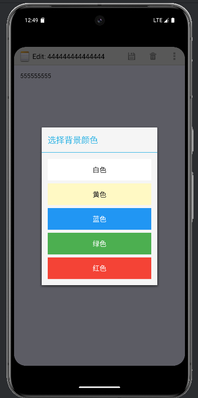

# NotePad笔记本应用功能说明

主要功能：
## 1. 时间戳功能

### 实现思路：
1. 在NotePad.java中添加修改时间的字段定义
2. 在NotePadProvider.java中实现时间格式化
3. 在NotesList.java中显示时间戳
4. 修改布局文件以适应时间显示

### 关键代码：
1. 在NotePad.java中添加字段：

public static final String 
COLUMN_NAME_MODIFICATION_DATE = "modified";

2. NotePadProvider.java中的时间格式化：

Long now = Long.valueOf(System.currentTimeMillis());
Date date = new Date(now);
SimpleDateFormat simpleDateFormat = new SimpleDateFormat("yyyy-MM-dd HH:mm:ss");
simpleDateFormat.setTimeZone(TimeZone.getTimeZone("Asia/Shanghai"));
String dateFormat = simpleDateFormat.format(date);

3. NotesList.java中显示时间：

private static final String[] PROJECTION = new String[] {
NotePad.Notes.ID,
NotePad.Notes.COLUMN_NAME_TITLE,
NotePad.Notes.COLUMN_NAME_MODIFICATION_DATE
};

## 2. 搜索笔记功能
对笔记标题和笔记内容同时进行进行模糊搜索（显示标题或者内容包含搜索内容的笔记）：
如：搜索444

搜索555


### 实现思路：
1. 创建搜索界面布局
2. 实现搜索功能的Activity
3. 添加搜索选项到菜单
4. 实现实时搜索结果显示

### 关键代码：
1. NoteSearch.java中的搜索实现：
public boolean onQueryTextChange(String newText) {
Cursor cursor = sqLiteDatabase.query(
NotePad.Notes.TABLE_NAME,
PROJECTION,
NotePad.Notes.COLUMN_NAME_TITLE + " like? or " +
NotePad.Notes.COLUMN_NAME_NOTE + " like?",
new String[]{"%" + newText + "%", "%" + newText + "%"},
null,
null,
NotePad.Notes.DEFAULT_SORT_ORDER
);
}


2. 搜索界面布局(note_search.xml)：

xml
<SearchView
android:id="@+id/search_view"
android:layout_width="0dp"
android:layout_height="wrap_content"
android:queryHint="搜索笔记"
android:iconifiedByDefault="false"/>

推展功能：
## 拓展功能1. 界面美化
### （1）自动notelist颜色

#### 实现思路：
1. 在数据库中添加颜色字段
2. 创建颜色选择界面
3. 实现颜色选择和保存功能
4. 在笔记列表和编辑界面显示对应颜色

#### 关键代码：
1. NotePad.java中添加颜色常量：
   public static final String COLUMN_NAME_BACK_COLOR = "color";
   public static final int DEFAULT_COLOR = 0;
   public static final int YELLOW_COLOR = 1;
   public static final int BLUE_COLOR = 2;
   public static final int GREEN_COLOR = 3;
   public static final int RED_COLOR = 4;

2. NoteEditor.java中的颜色设置：
   private static final int[] BACKGROUND_COLORS = new int[] {
   Color.rgb(255, 182, 193), // 浅粉红
   Color.rgb(255, 218, 185), // 桃色
   Color.rgb(176, 224, 230), // 粉蓝色
   Color.rgb(144, 238, 144), // 淡绿色
   Color.rgb(230, 230, 250), // 淡紫色
   Color.rgb(255, 255, 224), // 浅黄色
   Color.rgb(245, 245, 245) // 浅灰色
   };

3. NoteBackgroundSet.java中的颜色选择实现：
   public void white(View view){
   color = NotePad.Notes.DEFAULT_COLOR;
   finish();
   }
   public void yellow(View view){
   color = NotePad.Notes.YELLOW_COLOR;
   finish();
   }

（2）（主动更换背景）



### 实现思路：
1. 在笔记编辑界面添加更换背景按钮
2. 点击按钮弹出颜色选择对话框
3. 选择颜色后立即应用到当前笔记

### 关键代码：
1. 添加菜单项：
   xml
   <item android:id="@+id/menu_color"
   android:icon="@android:drawable/ic_menu_edit"
   android:title="change background"
   android:showAsAction="ifRoom|withText" />


2. 处理菜单点击：
   case R.id.menu_color:
   Intent intent = new Intent(this, NoteBackgroundSet.class);
   intent.setData(mUri);
   startActivity(intent);
   break;
   3.note_color.xml颜色选择对话框布局：
+ <?xml version="1.0" encoding="utf-8"?>
+ <LinearLayout xmlns:android="http://schemas.android.com/apk/res/android"
+     android:orientation="vertical"
+     android:layout_width="match_parent"
+     android:layout_height="match_parent"
+     android:padding="16dp"
+     android:background="#F5F5F5">
+
+     <Button
+         android:id="@+id/color_white"
+         android:layout_width="match_parent"
+         android:layout_height="wrap_content"
+         android:text="白色"
+         android:textColor="#212121"
+         android:background="#FFFFFF"
+         android:layout_marginBottom="8dp"
+         android:padding="16dp"
+         android:onClick="white"/>
+//其他颜色按钮设置同上

4. 在NotePad.java中定义颜色相关常量：
+ ```java
+ public static final String COLUMN_NAME_BACK_COLOR = "color";
+ public static final int DEFAULT_COLOR = 0; // 白色
+ public static final int YELLOW_COLOR = 1;  // 黄色
+ public static final int BLUE_COLOR = 2;    // 蓝色
+ public static final int GREEN_COLOR = 3;   // 绿色
+ public static final int RED_COLOR = 4;     // 红色
## 拓展功能2. 导出笔记功能
实现效果：
1. 在笔记编辑界面点击"Export note"按钮
2. 将当前笔记内容导出为txt文件
3. 保存到设备的Download目录
4. 导出成功后显示文件保存路径


### 实现思路：
1. 在编辑界面菜单中添加导出选项
2. 实现文件导出功能
3. 添加必要的存储权限
4. 导出成功后显示提示信息

### 关键代码：
1. 在AndroidManifest.xml中添加权限：
```xml
<uses-permission android:name="android.permission.WRITE_EXTERNAL_STORAGE" />
<uses-permission android:name="android.permission.READ_EXTERNAL_STORAGE" />
```

2. 在editor_options_menu.xml中添加导出菜单项：
```xml
<item android:id="@+id/menu_export"
    android:icon="@android:drawable/edit_text"
    android:title="Export note" />
```

3. NoteEditor.java中实现导出功能：
```java
private void exportNote() {
    String title = mCursor.getString(mCursor.getColumnIndex(NotePad.Notes.COLUMN_NAME_TITLE));
    String content = mText.getText().toString();
    
    // 创建文件名
    String fileName = title.replaceAll("[^a-zA-Z0-9]", "_") + ".txt";
    
    // 获取下载目录
    File dir = new File(Environment.getExternalStorageDirectory(), "Download");
    if (!dir.exists()) {
        dir.mkdirs();
    }
    
    // 创建文件
    File file = new File(dir, fileName);
    
    try {
        // 写入笔记内容
        FileOutputStream fos = new FileOutputStream(file);
        fos.write(content.getBytes());
        fos.close();
        
        // 显示成功提示
        Toast.makeText(this, "Note exported to " + file.getAbsolutePath(), 
            Toast.LENGTH_LONG).show();
    } catch (IOException e) {
        e.printStackTrace();
        Toast.makeText(this, "Failed to export note", Toast.LENGTH_SHORT).show();
    }
}
```

  所有功能的完整代码可在对应的源文件中找到：
1. 时间戳功能相关：
- NotePad.java: 定义修改时间字段
- NotePadProvider.java: 实现时间格式化和数据库操作
- NotesList.java: 显示笔记列表和时间戳
- noteslist_item.xml: 笔记列表项布局，包含时间显示

2. 搜索功能相关：
- NoteSearch.java: 实现搜索功能的Activity
- note_search.xml: 搜索界面布局
- searchlist_item.xml: 搜索结果列表项布局
- AndroidManifest.xml: 注册搜索Activity

3. 背景颜色相关：
- NoteBackgroundSet.java: 颜色选择Activity
- note_color.xml: 颜色选择对话框布局
- NoteEditor.java: 笔记编辑和背景色应用
- NotePad.java: 颜色相关常量定义
- NotePadProvider.java: 颜色数据的存储

4. 导出功能相关：
- NoteEditor.java: 实现导出功能
- editor_options_menu.xml: 添加导出菜单项
- AndroidManifest.xml: 声明存储权限

主要数据库相关文件：
- NotePad.java: 定义数据库结构和常量
- NotePadProvider.java: 实现数据库操作